<div align="center">

# PACT — Agentic Delivery Kit

**Plan → Act → Check → Transfer**

A method for running software delivery with **teams of AI agents** — reporting to a human Product
Owner, or to each other under a human sponsor — and the files that make it enforceable instead of
aspirational.



</div>

PACT is **agnostic by construction**: nothing in `core/` knows which AI model you use, which vendor
hosts it, or whether your backlog lives in Azure DevOps, GitHub Projects, Notion, a hosted
spreadsheet or — as a mirror — Slack. That is checked by CI, not promised in prose.

---

## What this is, and who it is for

PACT is a **delivery method** and the files that make it checkable. It is not a model, not a vendor
SDK, and not an agent that sits on a VM. You can run it by pasting prompts into a chat, from an IDE
agent, or with unattended coding CLIs on a machine you already operate — the kit does not start any
of those. What it does not cover is written down in
[`core/13-not-in-this-factory.md`](core/13-not-in-this-factory.md).

| You are | Approver | Start with |
|---|---|---|
| An **agency** delivering for a customer | The customer, outside your organisation | [`profiles/agency/`](profiles/agency/delta.md) |
| An **internal** product team | Usually the Product Owner | [`profiles/internal/`](profiles/internal/delta.md) |
| Running **coding bots** (a CLI on a VM, a scheduled orchestrator) | Still a human. The bot never sets `Closed` | [`docs/scenarios/agent-to-human.md`](docs/scenarios/agent-to-human.md), then [`agents/`](agents/README.md) |
| A **team of agents** — agents handing work to agents, a PO-agent inside a written mandate | The sponsor. Still a human; still the only one who sets `Closed` | [`docs/scenarios/agent-to-agent.md`](docs/scenarios/agent-to-agent.md) |
| Running an **existing bot system** — a manager bot, worker bots, maybe a review bot | A human outside the system | [`docs/scenarios/bot-team.md`](docs/scenarios/bot-team.md) |
| **Maintaining** this kit | — | [`automation/`](automation/README.md) and [`CONTRIBUTING.md`](CONTRIBUTING.md) |

---

## Start here

Two ways in. **By hand**, in the order below. Or **let an agent do it**: clone the kit, open the
kit folder itself as your workspace — runtimes read `AGENTS.md` and their rule files from the
folder you opened, never from a subfolder — and say *"Read `AGENTS.md` and set this up for my
team"*. [`AGENTS.md`](AGENTS.md) makes the agent run the
[onboarding interview](docs/onboarding/README.md) one block per turn: its first reply is a block
of questions, and no file is written before you confirm. Then it writes your `instance.yml`, the
context files, a setup plan and a pointer file for every runtime. If it hands you a finished
`instance.yml` instead of questions, it did not read `AGENTS.md`: paste the
[kick-off prompt](docs/onboarding/kickoff-prompt.md), which starts the interview whatever the
runtime has read — even a chat with no access to files. Both roads end at the same instance file.

| Step | Read | Time |
|:--:|---|:--:|
| 1 | **[docs/start-here.md](docs/start-here.md)** — the mental model | 10 min |
| 2 | **[docs/scenarios/README.md](docs/scenarios/README.md)** — which topology is yours: agents → human, agents → agents, independent agents, an existing bot team | 5 min |
| 3 | **[docs/quickstart-30min.md](docs/quickstart-30min.md)** — one real item from intake to Closed, without running anything | 30 min |
| 4 | **[docs/choose-your-track.md](docs/choose-your-track.md)** — which tool holds your work items, and what each one costs you | 5 min |
| 5 | **[docs/choose-your-profile.md](docs/choose-your-profile.md)** — agency or internal team | 5 min |
| 6 | Copy `instance.example.yml` to `instance.yml` and fill it in — names, topology, language, lifecycle, cadence and board belong there and nowhere else | 10 min |

You do **not** need to run a build to adopt this. Scripts are for people who want the automated gate
and for people who maintain the kit.

---

## The four phases — five categories, twelve states

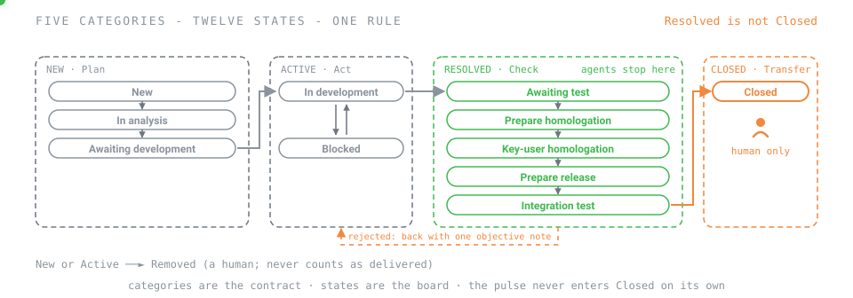

```mermaid
stateDiagram-v2
    direction LR
    state "NEW · Plan" as NEW {
        direction LR
        state "New" as n1
        state "In analysis" as n2
        state "Awaiting development" as n3
        n1 --> n2
        n2 --> n3
    }
    state "ACTIVE · Act" as ACTIVE {
        direction LR
        state "In development" as a1
        state "Blocked" as a2
        a1 --> a2
        a2 --> a1
    }
    state "RESOLVED · Check" as RESOLVED {
        direction LR
        state "Awaiting test" as r1
        state "Prepare homologation" as r2
        state "Key-user homologation" as r3
        state "Prepare release" as r4
        state "Integration test" as r5
        r1 --> r2
        r2 --> r3
        r3 --> r4
        r4 --> r5
    }
    state "CLOSED · Transfer" as CLOSED
    state "REMOVED" as REMOVED
    [*] --> NEW : intake
    NEW --> ACTIVE : DoR met · handoff · claim
    ACTIVE --> RESOLVED : push · CI green · reviews pass · receipt
    RESOLVED --> ACTIVE : rejected
    RESOLVED --> CLOSED : a human accepts the value
    CLOSED --> [*]
    NEW --> REMOVED
    ACTIVE --> REMOVED
    note right of RESOLVED
        agents stop here
    end note
    note right of CLOSED
        humans only
    end note
```

| Phase | Category | Default states | Who | What happens | Artifact |
|---|---|---|---|---|---|
| **P**lan | `New` | New · In analysis · Awaiting development | Product Owner, then orchestrator | Value, scope and criteria. Definition of Ready ends the category | [handoff](templates/flow/handoff.md) |
| **A**ct | `Active` | In development · Blocked | One implementer | A **single** writing agent works inside a claimed scope | diff + claim |
| **C**heck | `Resolved` | Awaiting test · Prepare homologation · Key-user homologation · Prepare release · Integration test | CI, then reviewers (read-only), then the people who test | Parallel verdicts plus risk classification; then whatever human tests the instance turned on | [receipt](templates/flow/receipt.md) |
| **T**ransfer | `Closed` | Closed | Approver — always a human | The value is accepted; ownership changes hands | [conclusion comment](templates/flow/conclusion-comment.md) |

One rule holds the whole thing together: **`Resolved ≠ Closed`**. Agents deliver up to **Check** and
stop. **Transfer** is always human. The five categories are the contract — every rule, the gate and
every track read them, and they never change. The twelve states are the default board
([`core/05-states.md`](core/05-states.md)); an instance runs a subset, labels it in its own
language, and never drops a category. `Removed` is the exit for work that will not happen — a
human's call, never counted as delivered.

---

## Two scenarios, four topologies

Agents deliver **to a human**, or agents deliver **to agents** — and a person still accepts at the
end. The method does not change between the two; who fills each role does. The instance records
it once (`instance.yml` → `topology`), and the instance check refuses a roster that contradicts it.

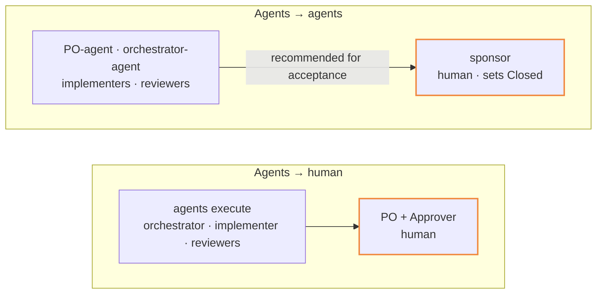

| Topology | Looks like | The human at the end | Guide |
|---|---|---|---|
| **agent-to-human** | One PO, one or a few agents; prompts in a chat, or a coding CLI on a VM | The PO, as Approver | [`agent-to-human.md`](docs/scenarios/agent-to-human.md) |
| **agent-to-agent** | A company of agents: a PO-agent refines inside a written mandate, an orchestrator-agent runs the queue, implementers and reviewers are agents | The sponsor, who sets `Closed` — in batch if they like | [`agent-to-agent.md`](docs/scenarios/agent-to-agent.md) |
| **independent-agents** | Specialised agents, one item each, dispatched by a person; no queue worth an orchestrator | The dispatcher | [`independent-agents.md`](docs/scenarios/independent-agents.md) |
| **bot-team** | A bot system that already exists — a manager bot, worker bots, maybe a review bot. PACT wraps it; its roles map onto the roster | Someone outside the system | [`bot-team.md`](docs/scenarios/bot-team.md) |

In all four, agents coordinate **through the source of truth** — the handoff, the claim, the
conclusion comment and the digest live on the item — never through a channel
(`RULE-TOPOLOGY-COORDINATION`, `AP-BOT-CHATTER`). The rule is
[`core/15-topologies.md`](core/15-topologies.md); the PO-agent's mandate, and the human gates at
its edge, are in the agent-to-agent guide.

---

## Humans, agents, and unattended runtimes

The method names five roles by **function** ([`core/01-roles.md`](core/01-roles.md)). Who fills each
one — a person, an agent, a script, a rota — is recorded in
[`instance.example.yml`](instance.example.yml). The Approver is always human (`RULE-ROLES`). The
Implementer and the Reviewer are never the same agent on the same item.

| Role | Typically | Owns | Never |
|---|---|---|---|
| **Product Owner** | Typically a human (or an agent under a human) | Priority, value, acceptance | Executes tasks; edits code. The Approver — not this role — is the one that must always be human |
| **Orchestrator** | An agent | Queue, handoffs, claims, escalation | Chooses value; sets `Closed` |
| **Implementer** | An agent | One claimed scope, the change, the receipt | Writes outside the claim; reviews its own work |
| **Reviewer** | A second agent, read-only | Findings **and** a risk verdict | Edits the change under review |
| **Approver** | A human | `Closed`; credentials; anything published | Delegates `Closed` to an agent |

The roster also carries an **advisor**, [`po-assistant`](agents/briefs/po-assistant.md). In *guide*
mode it answers a person's questions about the method and the ceremonies; in *refine* mode it turns
a raw request into a [refined specification](templates/flow/refined-spec.md) — one Feature, one story
per independent deliverable, *Given / When / Then* scenarios, rules, risks, open questions. It owns
no scope and sets no state. Everything it — or any agent — writes for a person takes the shape of
[`core/16-writing-standard.md`](core/16-writing-standard.md), in the language the instance declares.

The same roles hold whether a person is pasting prompts or a bot is driving a coding CLI on a VM.
This kit does **not** launch that CLI, that VM, or that model. It is the method those bots run
*under*.

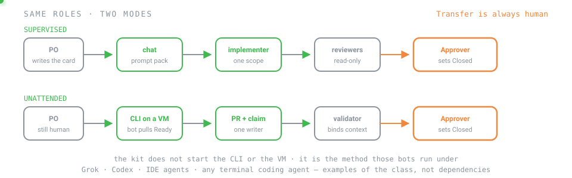

```mermaid
flowchart LR
    po[Product Owner] --> ho[handoff]
    ho --> cli["coding CLI on a VM"]
    cli --> pr[PR]
    pr --> val[PR validator]
    val --> rev[parallel reviewers]
    rev --> rec[receipt]
    rec --> ap[Approver]
    ap --> cl[Closed]
    style po stroke:#8b949e,stroke-width:2px
    style cli stroke:#3fb950,stroke-width:2px
    style val stroke:#3fb950,stroke-width:2px
    style ap stroke:#f0883e,stroke-width:2px
    style cl stroke:#f0883e,stroke-width:2px
```

| Mode | What it looks like | Who is at the keyboard | What still cannot be automated |
|---|---|---|---|
| **Supervised** | Paste [`adapters/prompt-pack/out/`](adapters/prompt-pack/out/README.md) into any chat; a human writes the card and accepts | A human drives Plan and Transfer | `Closed`; money, access, publication; the five HITL triggers |
| **Unattended** | A bot pulls `Ready` items, claims a scope, opens a PR, posts the receipt and the conclusion comment | Nobody, until a gate fires | The same. The PR validator refuses an agent setting `Closed` on the context it is given (`RULE-STATE-RESOLVED-NOT-CLOSED`) |

Examples of the *class* — not dependencies, not adapters that ship here: a Grok CLI on a VM, a Codex
CLI, Cursor or other IDE agents, Claude or Gemini in a chat, any other terminal coding agent. The
kit ships **no** vendor adapter ([`adapters/README.md`](adapters/README.md)). Until you write one
from [`adapters/_template/`](adapters/_template/README.md), the prompt pack is the binding: agents
that know the rules, and a gate that does not care whether they did.

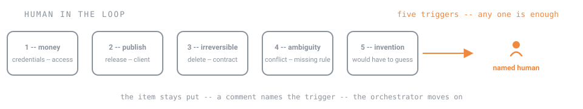

A human is in the loop wherever there is money, access, external publication, an irreversible
product decision, or ambiguity — five triggers, each enough on its own
([`core/03-human-in-the-loop.md`](core/03-human-in-the-loop.md)). Escalation is data in
[`agents/policies/escalation.yml`](agents/policies/escalation.yml), not a hope that the bot notices.
The PR validator binds **high risk** (`RULE-RISK-GATES`). The other four triggers are conditions
for the orchestrator and for humans; they are advisory in the gate until expressed as `high`.

Bot farms fail in predictable ways. An agent setting `Closed` is `AP-AGENT-CLOSES`. Several writers
on one tree is `AP-SWARM`. Bots talking to bots in a channel is `AP-BOT-CHATTER`. An agent merging
its own change is `AP-SELF-MERGE`. Trace lives on the work item; the channel carries notifications.
See [`core/12-anti-patterns.md`](core/12-anti-patterns.md).

---

## The three ideas worth stealing even if you adopt nothing else

### 1 · Resolved is not Closed

An agent finishing its work is not the same as value being accepted. Keep **two separate axes** — the
work item's state, grouped in five fixed categories, and the board column — and never let an agent
move either one past the Resolved category.

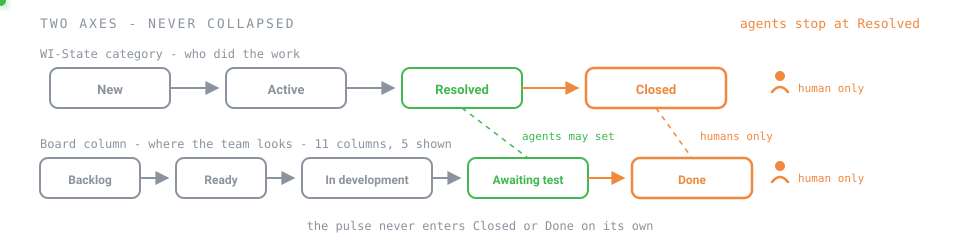

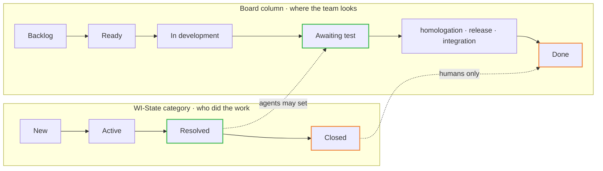

See [`core/04-work-item-model.md`](core/04-work-item-model.md).

### 2 · N readers, one writer

Parallel review is cheap and safe because reviewers only read. Parallel *implementation* is neither.
One agent owns writes to a scope at a time, and a claim **in the source of truth** proves it.

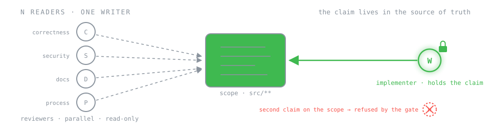

See [`core/09-concurrency.md`](core/09-concurrency.md) and [`agents/ownership.yml`](agents/ownership.yml).

### 3 · Risk comes out of the review, not after it

Each reviewer returns findings *and* a risk verdict; a per-path floor is applied on top. The floor
protects you from an optimistic reviewer, the verdict protects you from a blind rule.


See [`core/08-review-and-risk.md`](core/08-review-and-risk.md) and
[`agents/policies/risk-floors.yml`](agents/policies/risk-floors.yml).

---

## Architecture

The dependency arrow points one way. `core/` never mentions a tool, a vendor or a profile — and a CI
check fails the build if it ever does.

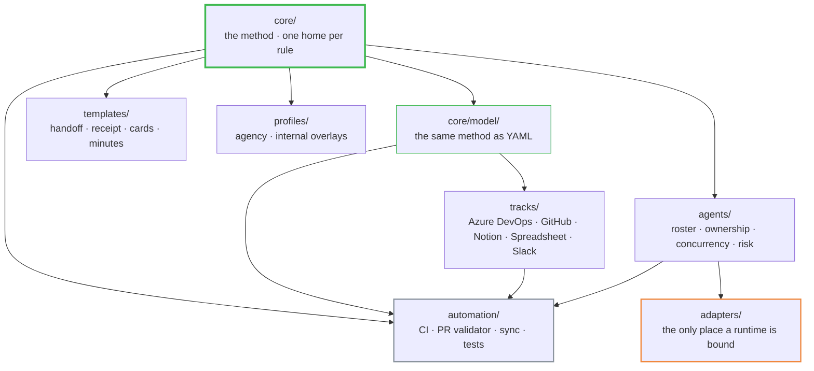

| Directory | What it holds | Files | Depends on |
|---|---|:--:|---|
| `core/` | The method. Every rule has exactly one home here | 34 | nothing |
| `templates/` | Artifacts that leave the repo: handoff, receipt, refined spec, cards, minutes | 31 | `core/` |
| `tracks/` | Translation per tool. No method is rewritten here | 40 | `core/model/` |
| `agents/` | Reviewer roster, ownership, concurrency, risk policy | 16 | `core/` |
| `adapters/` | The only place a runtime is bound to the roster | 17 | `agents/` |
| `profiles/` | `agency` and `internal` overlays — add and configure, never redefine | 18 | `core/` |
| `automation/` | Copy-ready CI, the PR validator, the iteration name and entry-point scripts, parameterised sync, tests | 54 | all of the above |
| `docs/` + `examples/` | Guides, scenarios, the onboarding interview, decisions, the generated matrix, a trivial end-to-end walkthrough and its sprint close | 45 | — |
| `schemas/` | JSON Schema for the YAML the kit ships | 7 | `core/model/` |

File counts are `*.md` `*.yml` `*.yaml` `*.py` `*.json` `*.svg` `*.wiql` `*.graphql` under each tree, including the nine pictures in `docs/assets/`. They go stale the moment a file is added — treat them as a snapshot, not a lock.

---

## The map

The table above is the layers. This is every reader-facing document, by tree. Open the row that
matches the job in front of you; do not read the kit cover to cover. Two ways to bring it into a
repository — copy-out, or vendored at `.pact/` — are in
[`docs/adopt-and-upgrade.md`](docs/adopt-and-upgrade.md).

### Root

| Document | What it is | Who opens it |
|---|---|---|
| This page | The method in one sitting | Everyone |
| [`AGENTS.md`](AGENTS.md) | The entry point for an agent asked to read, set up or use this repository: three requests, the setup protocol, the rules that bind it, the map. A pointer file per runtime — `CLAUDE.md`, `.claude/rules/pact.md`, `.hermes.md`, `.grok/rules/pact.md`, `.grokbot/rules/pact.md`, `.openclaw/rules/pact.md`, `.codex/rules/pact.md` and the rest, generated by `automation/scripts/entry_points.py` (`--list`) — lands on it | Every agent runtime; whoever clones the kit |
| [`GLOSSARY.md`](GLOSSARY.md) | One line per term the kit uses | Anyone stuck on a word |
| [`CONTRIBUTING.md`](CONTRIBUTING.md) | How to change `core/`, a track, or an adapter | Maintainers |
| [`CHANGELOG.md`](CHANGELOG.md) | SemVer on the *contract*, not the prose | Adopters taking a new version |
| [`instance.example.yml`](instance.example.yml) | The only file that knows your names, board and cadence | Everyone adopting |
| [`LICENSE`](LICENSE) · [`NOTICE`](NOTICE) | Apache 2.0; attribution is to the kit | Legal |
| [`schemas/`](schemas/model.schema.json) | JSON Schema for instance, model, mapping, capabilities, roster, ownership, policies | Maintainers; anyone adding YAML |

### `docs/` — guides and decisions

| Document | What it is | Who opens it |
|---|---|---|
| [`start-here.md`](docs/start-here.md) | The mental model in ten minutes | First day |
| [`quickstart-30min.md`](docs/quickstart-30min.md) | One real item, by hand, nothing to install | First day |
| [`scenarios/`](docs/scenarios/README.md) | One page per topology — agent-to-human, agent-to-agent, independent-agents, bot-team: who is human, how to set it up, what changes in each phase | Deciding who is human |
| [`onboarding/`](docs/onboarding/README.md) | The interview an agent runs on you, the kick-off prompt to paste when nothing loaded it, and the setup plan it writes afterwards | Letting an agent set the kit up |
| [`choose-your-track.md`](docs/choose-your-track.md) | Which tool holds work items, and what each costs | Setting up a board |
| [`choose-your-profile.md`](docs/choose-your-profile.md) | Agency or internal — who the Approver is | Setting up an instance |
| [`architecture.md`](docs/architecture.md) | Why the kit is shaped this way | Curious readers; maintainers |
| [`adopt-and-upgrade.md`](docs/adopt-and-upgrade.md) | Copy-out vs `.pact/` subtree; what a version bump means | Adopting and upgrading |
| [`compatibility-matrix.md`](docs/compatibility-matrix.md) | Generated: each rule × each track | Choosing a track |
| [`verification.md`](docs/verification.md) | What "works" means, and what is deliberately not checked | Maintainers; honest adopters |
| [ADR 0001](docs/decisions/0001-canon-blocks-instead-of-template-engine.md) | Canon blocks, not a template engine | Maintainers |
| [ADR 0002](docs/decisions/0002-neutral-model-as-yaml-contract.md) | The neutral model is a YAML contract | Anyone writing a track |
| [ADR 0003](docs/decisions/0003-adapters-are-one-way-generators.md) | Adapters generate one way | Anyone writing a runtime adapter |
| [ADR 0004](docs/decisions/0004-single-writer-per-scope.md) | Single writer, enforced by the gate | Anyone running more than one agent |
| [`assets/`](docs/assets/pact-flow.svg) | Animated pictures: [PACT flow](docs/assets/pact-flow.svg), [lifecycle](docs/assets/lifecycle.svg), [two axes](docs/assets/two-axes.svg), [readers/writer](docs/assets/readers-writer.svg), [risk](docs/assets/risk-formula.svg), [modes](docs/assets/humans-modes.svg), [HITL](docs/assets/hitl-triggers.svg), [tracks](docs/assets/tracks-coverage.svg), [two layers](docs/assets/two-layers.svg) | — |

### `core/` — the method

Every rule lives in exactly one file and is cited elsewhere by id. The reading order is
[`core/README.md`](core/README.md) — do not skip it. Nothing in this tree names a tool, a vendor or
a runtime.

| Document | What it is | Who opens it |
|---|---|---|
| [`core/README.md`](core/README.md) | Index: roles, golden rules, HITL, work items, states, DoR/DoD, evidence, review and risk, concurrency, merge, docs-in-code, anti-patterns, honesty, homologation, topologies, writing standard | First day through adoption |
| [`ceremonies/`](core/ceremonies/README.md) | Planning, the daily digest, the sprint close (review → retrospective → refinement, one session), iteration naming, participation by topology — agents "attend" by writing on the ceremony item | Running an iteration |
| [`model/`](core/model/README.md) | The same method as YAML: types, states, fields, gates, capabilities, rules | Building tooling; writing a track |

### `templates/` — artifacts that leave the repo

Self-contained. They cite `Canon: RULE-…`; they never restate the rule.
[`templates/README.md`](templates/README.md) explains the fences and the placeholders.

| Document | What it is | Who opens it |
|---|---|---|
| [`flow/handoff.md`](templates/flow/handoff.md) | Definition of Ready made concrete | Orchestrator → implementer |
| [`flow/receipt.md`](templates/flow/receipt.md) | Definition of Done made concrete, including *Not verified / not claimed* | Implementer at `Resolved` |
| [`flow/conclusion-comment.md`](templates/flow/conclusion-comment.md) | Six mandatory fields before leaving Active | Active → Resolved, and human Transfer notes |
| [`flow/scope-claim.md`](templates/flow/scope-claim.md) | The claim as it is recorded in the source of truth | Act |
| [`flow/refined-spec.md`](templates/flow/refined-spec.md) | A Feature and its stories with *Given / When / Then* scenarios, rules to validate, risks, refinement questions and the registration tree — what the PO assistant writes from a raw request | PO assistant → PO; anyone refining |
| [Epic](templates/work-items/epic.md) · [Feature](templates/work-items/feature.md) · [Story](templates/work-items/user-story.md) · [Task](templates/work-items/task.md) · [Bug](templates/work-items/bug.md) · [Issue](templates/work-items/issue.md) | Card shapes | Writing work items |
| [Planning](templates/ceremonies/planning-minutes.md) · **[Sprint close](templates/ceremonies/sprint-close-minutes.md)** · [Refinement](templates/ceremonies/refinement-minutes.md) · [Review](templates/ceremonies/review-minutes.md) · [Retrospective](templates/ceremonies/retrospective-minutes.md) | Ceremony minutes; the sprint close carries the retro cards and the carry-over table | Humans in an iteration; agents on the ceremony item |
| [`AGENTS.md`](templates/agent-context/AGENTS.md) | The adopter's entry file: where the instance is, which topology, which brief to load first | Every agent session, before anything else |
| [`AGENT-CONTEXT.md`](templates/agent-context/AGENT-CONTEXT.md) | Stable context, next to the code | Every agent session |
| [`CURRENT-FOCUS.md`](templates/agent-context/CURRENT-FOCUS.md) | Volatile: this week, this branch, out of scope | Every agent session |
| [`_fragments/`](templates/_fragments/actions-table.md) | Fenced sources — the actions table, the ceremony header, the [retro cards](templates/_fragments/retro-cards.md), the trace dates, the [icon legend](templates/_fragments/icon-legend.md) — copied into templates and briefs; `make canon` byte-checks them | Maintainers |

### `tracks/` — one tool each, no method

A track is translation. If you find yourself explaining *why* Resolved is not Closed inside a
track, that sentence belongs in `core/`. Index: [`tracks/README.md`](tracks/README.md). Contract:
[`tracks/_contract/track-contract.md`](tracks/_contract/track-contract.md).

| Track | Human docs | Source of truth? |
|---|---|---|
| [Azure DevOps](tracks/azure-devops/README.md) | [setup](tracks/azure-devops/setup.md), [fields](tracks/azure-devops/fields.md), [policies](tracks/azure-devops/policies.md) | ✅ — most of the method is native |
| [GitHub Projects](tracks/github-projects/README.md) | [setup](tracks/github-projects/setup.md), [fields](tracks/github-projects/fields.md) | ✅ — Issues, Projects, PRs and Actions |
| [Notion](tracks/notion/README.md) | [setup](tracks/notion/setup.md), [fields](tracks/notion/fields.md), [views](tracks/notion/views.md), [substitutes](tracks/notion/substitutes.md) | ✅ — the review gate is people-enforced |
| [Spreadsheet](tracks/spreadsheet/README.md) | [setup](tracks/spreadsheet/setup.md), [fields](tracks/spreadsheet/fields.md), [substitutes](tracks/spreadsheet/substitutes.md) | ✅ **hosted only** — version history and comments make it a record; a first week, not a year |
| [Slack](tracks/slack/README.md) | [setup](tracks/slack/setup.md), [fields](tracks/slack/fields.md), [channels](tracks/slack/channels.md), [substitutes](tracks/slack/substitutes.md), [item event](tracks/slack/event-formats/item-event.md) · [digest](tracks/slack/event-formats/digest.md) · [human gate](tracks/slack/event-formats/human-gate.md) | ❌ never — a channel is not a durable record |

### `agents/` — organised, and unable to collide

Nothing here names a runtime. [`agents/README.md`](agents/README.md) is the guarantee: the runtime
is advisory; the PR validator is binding.

| Document | What it is | Who opens it |
|---|---|---|
| [`roster.yml`](agents/roster.yml) | Which agents exist, what each consumes and produces | Adapters; the instance |
| [`ownership.yml`](agents/ownership.yml) | Scopes, who may write, who must review, the risk floor | The PR validator, on every change |
| [`concurrency.yml`](agents/concurrency.yml) | Claim lifetime, one per scope, who arbitrates a collision | Orchestrator + validator |
| [`policies/risk-floors.yml`](agents/policies/risk-floors.yml) | Per-path minimum risk | Check |
| [`policies/gates.yml`](agents/policies/gates.yml) | What each risk level demands | Check |
| [`policies/escalation.yml`](agents/policies/escalation.yml) | The five HITL triggers as checkable conditions | Orchestrator |
| [Orchestrator](agents/briefs/orchestrator.md) · [implementer](agents/briefs/implementer.md) · [correctness](agents/briefs/reviewer-correctness.md) · [security](agents/briefs/reviewer-security.md) · [docs](agents/briefs/reviewer-docs.md) · [delivery compliance](agents/briefs/reviewer-delivery-compliance.md) · [PO assistant](agents/briefs/po-assistant.md) | One prose brief per agent, written so a person could follow it. Adapters copy them verbatim | Humans and adapters |

### `adapters/` — the only place a runtime is bound

An adapter is a pure, one-way generator: it reads `agents/`, writes its own `out/`, and never edits
upstream. [`adapters/README.md`](adapters/README.md).

| Document | What it is | Who opens it |
|---|---|---|
| [`prompt-pack/`](adapters/prompt-pack/README.md) | One Markdown prompt per agent, any chat, any model. [Generated `out/`](adapters/prompt-pack/out/README.md) | Supervised mode; the proof the roster is neutral |
| [`_template/`](adapters/_template/README.md) | Skeleton to copy for a runtime of your own | Anyone binding a CLI, an IDE, or a bot |
| [`_contract/adapter-spec.md`](adapters/_contract/adapter-spec.md) | What a directory under `adapters/` must be | Contributing an adapter |

### `profiles/` — overlay, never a rewrite

A profile configures the method for one kind of organisation; it cannot switch off a mandatory
rule. [`profiles/README.md`](profiles/README.md) · contract: [`profiles/_contract.md`](profiles/_contract.md).

| Profile | What it adds | Who opens it |
|---|---|---|
| **agency** — Approver is the customer | [What differs](profiles/agency/delta.md); [acceptance sign-off](profiles/agency/templates/acceptance-signoff.md), [scope-change request](profiles/agency/templates/scope-change-request.md), [client status report](profiles/agency/templates/client-status-report.md); guides: [onboarding](profiles/agency/guides/client-onboarding.md), [boundaries and billing](profiles/agency/guides/boundaries-and-billing.md), [data handling](profiles/agency/guides/data-handling-and-access.md) | You deliver for an external customer |
| **internal** — Approver is usually the PO | [What differs](profiles/internal/delta.md); [stakeholder update](profiles/internal/templates/stakeholder-update.md), [roadmap alignment](profiles/internal/templates/roadmap-alignment.md); guides: [discovery and intake](profiles/internal/guides/discovery-and-intake.md), [cross-squad dependencies](profiles/internal/guides/cross-squad-dependencies.md) | You build a product with internal stakeholders |

### `automation/` — the gate, and the kit's own CI

Two audiences, kept apart ([`automation/README.md`](automation/README.md)). Adopters who want **no**
automation skip this directory. The method works on paper.

| Document | What it is | Who opens it |
|---|---|---|
| [`scripts/validate_pr.py`](automation/scripts/validate_pr.py) | The binding layer: scope, claims, reviewers, risk, evidence | Anyone who wants the automated gate |
| [`ci/INSTALL.md`](automation/ci/INSTALL.md) | Copy-ready GitHub Actions and Azure Pipelines | Wiring the gate in your repo |
| [`sync/README.md`](automation/sync/README.md) | Mirror the source of truth; post events. One writer | Pairing a SoT with Slack (or another track) |
| [`sync/SECURITY.md`](automation/sync/SECURITY.md) | Tokens from the environment; `--dry-run` by default | Before `--apply` |
| `scripts/check_*.py` | Leaks, links, schemas, mapping, canon, instance — what `make check` runs | Maintainers of the kit |

### `examples/` — four instances, one spec, one sprint close and one boring item

Everything is fictitious, so the *shape* of each artifact is what you notice.
[`examples/README.md`](examples/README.md).

| Document | What it is | Who opens it |
|---|---|---|
| [`instance-internal-github.yml`](examples/instance-internal-github.yml) | Internal profile, GitHub Projects, Slack mirror | Copying an instance |
| [`instance-agency-azure-devops.yml`](examples/instance-agency-azure-devops.yml) | Agency profile, Azure DevOps, Slack mirror | Copying an instance |
| [`instance-internal-notion-slack.yml`](examples/instance-internal-notion-slack.yml) | Internal profile, Notion SoT, Slack mirror, independent agents | Copying an instance |
| [`instance-internal-spreadsheet.yml`](examples/instance-internal-spreadsheet.yml) | Internal profile, a hosted spreadsheet as SoT, six of the twelve states | Copying an instance for a first week |
| [`walkthrough/`](examples/walkthrough/README.md) | WI-42, export list as CSV: [intake](examples/walkthrough/00-intake.md) → [story](examples/walkthrough/01-refined-story.md) → [handoff](examples/walkthrough/02-handoff.md) → [PR body](examples/walkthrough/03-pr-body.md) → [receipt](examples/walkthrough/04-receipt.md) → [conclusion](examples/walkthrough/05-conclusion-comment.md) → [closed](examples/walkthrough/06-closed.md) | Seeing every gate once |
| [`spec/refined-spec-example.md`](examples/spec/refined-spec-example.md) | The raw e-mail that became Feature WI-40 and four stories with scenarios — the refine mode's output, and where WI-42 came from | Seeing what a refined spec looks like |
| [`ceremonies/sprint-close-example.md`](examples/ceremonies/sprint-close-example.md) | The Friday session of the week WI-42 shipped: the ceremony item, retro cards from a person and three agents, the carry-over of three open items, the next iteration named | Seeing a sprint close once |

---

## Five tools, one contract

Every track must map **100 % of the method's 35 symbols** — natively, with a custom field, or by
declaring a substitute. Nothing is allowed to be silently missing.

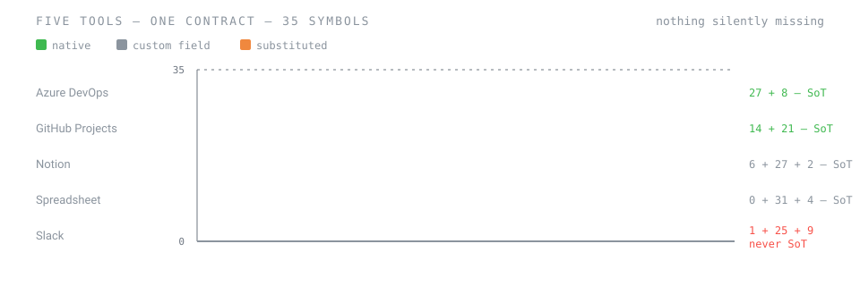

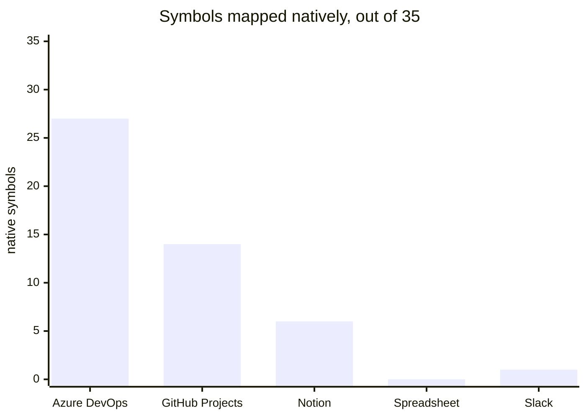

| Track | Native | Custom | Substituted | Review gate | CI | Source of truth |
|---|:--:|:--:|:--:|---|---|:--:|
| [Azure DevOps](tracks/azure-devops/README.md) | 27 | 8 | 0 | branch policy | Pipelines | ✅ |
| [GitHub Projects](tracks/github-projects/README.md) | 14 | 21 | 0 | CODEOWNERS + ruleset | Actions | ✅ |
| [Notion](tracks/notion/README.md) | 6 | 27 | 2 | substituted — people tick boxes | in the code host | ✅ |
| [Spreadsheet](tracks/spreadsheet/README.md) | 0 | 31 | 4 | in the code host | in the code host | ✅ hosted only — version history and comments |
| [Slack](tracks/slack/README.md) | 1 | 25 | 9 | in the code host | — | ❌ — a channel is not a durable record |

The rule × capability cross-product is generated, not hand-written:
[`docs/compatibility-matrix.md`](docs/compatibility-matrix.md).

---

## One item, end to end

The walkthrough follows a deliberately boring item — *export a list as CSV* at a fictitious company —
through every gate the kit has.

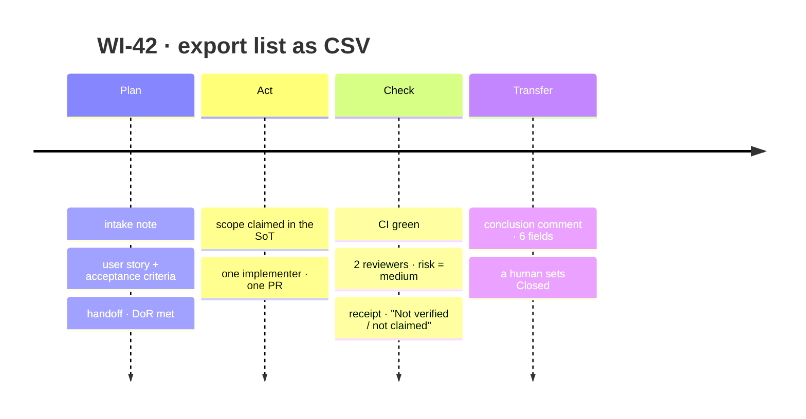

Read it in [`examples/walkthrough/`](examples/walkthrough/README.md). It is also a test: the kit's own
gate passes it, and fails it when it is tampered with.

---

## The gate

`automation/scripts/validate_pr.py` is binding **on the context it receives**. It does not read
the board. The copy-ready workflow takes a fenced `pact-context` block from the PR body (or a
`context.json` you generate). Claims, verdicts, `verification.passed`, `actor_role` and
`human_review` are whatever that input says. A green guard is not proof that the source of truth
agrees — until a CI step builds the context from the board, it is a check of a declaration.
[`automation/ci/INSTALL.md`](automation/ci/INSTALL.md) is the honest install path.

It does not care which model or runtime produced the change. It refuses a PR when:

| Finding | Rule |
|---|---|
| A path falls in a scope the item has not claimed | `RULE-SCOPE` |
| A claimed scope is not in the handoff | `RULE-GOLDEN-SCOPE` |
| Another item holds an open claim on a touched scope | `RULE-CLAIM` |
| A required reviewer has not returned a verdict, or returned `block`, or left a blocking finding | `RULE-REVIEW-GATE` |
| `MAX(verdicts, floors)` disagrees with the item's risk field | `RULE-RISK` |
| Risk is `high` and no named human reviewed | `RULE-RISK-GATES` |
| Verification has not passed | `RULE-REVIEW-GATE` |
| An agent tries to set `Closed` | `RULE-STATE-RESOLVED-NOT-CLOSED` |
| A New-category state straight to a Resolved-category one (nothing was executed); `Closed` from outside the Resolved category; a state the model does not know | `RULE-STATES` |
| No conclusion comment at all | `RULE-TRANSITION-BARRIER` |
| The conclusion comment lacks a field, or says `closed`, or has prose where evidence should be | `RULE-CONCLUSION-COMMENT`, `RULE-EVIDENCE` |
| The receipt lacks *Not verified / not claimed*, has no per-AC rows, or has a failing AC | `RULE-DOD` |
| `require_client_signoff` is on and `Closed` has no recorded client sign-off | `RULE-OPT-CLIENT-SIGNOFF` |
| `require_homologation_qa` is on and `Closed` has no feature branch, homologation URL, QA handoff, or key-user test for the PO | `RULE-OPT-HOMOLOG-QA` |

The same table lives in [`automation/README.md`](automation/README.md).

Copy-ready workflows for GitHub Actions and Azure Pipelines live in
[`automation/ci/`](automation/ci/INSTALL.md).

---

## Bring your own runtime

The guarantees have two layers, on purpose ([`agents/README.md`](agents/README.md)).

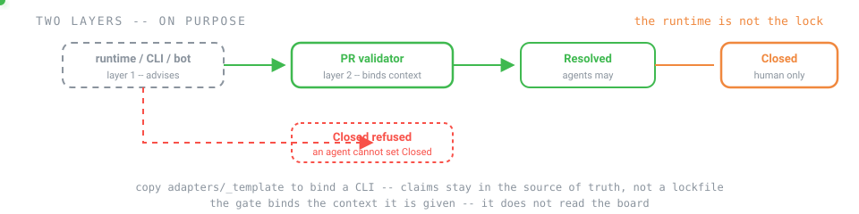

| Layer | What | Trusted? |
|---|---|---|
| **1 — the runtime** | Your chat, IDE agent, coding CLI, or a bot on a VM | Advisory. Helpful; not the lock |
| **2 — the PR validator** | [`automation/scripts/validate_pr.py`](automation/scripts/validate_pr.py), above | Binding **on its inputs**. Does not know which runtime produced the change, and does not read the board |

What ships today is the **prompt pack**: one Markdown file per agent, usable as the system prompt
in any chat with any model ([`adapters/prompt-pack/`](adapters/prompt-pack/README.md)). No
sub-agents, no tools, no file access assumed.

To bind a CLI that owns a VM — Grok, Codex, or any other terminal coding agent — copy
[`adapters/_template/`](adapters/_template/README.md) to `adapters/<name>/`, generate `out/`, and
put those files where the CLI reads its instructions. Claims still live in the source of truth, not
in a lockfile (`AP-CLAIM-IN-FILE`). `mapping.yml` must say, for each concept, whether the runtime
**enforces**, **advises**, or **does not support** it; unsupported concepts stand in with the PR
validator ([`adapters/_contract/adapter-spec.md`](adapters/_contract/adapter-spec.md)).

The kit does not start a VM, install a CLI, or call a model. An existing bot system — a manager bot
and its workers — is the `bot-team` topology: its roles map onto the roster, the same template binds
it, and the gate sits where it always sits ([`docs/scenarios/bot-team.md`](docs/scenarios/bot-team.md)).

---

## Verifying the kit

```bash
pip install -r automation/requirements.txt
make check     # everything the CI runs · about ten seconds
```

On Windows without `make`: `.\check.ps1`.

| Level | Command | Guards |
|---|---|---|
| **L0** | `make leaks` | no machine path, e-mail, handle, board / issue / repository / workspace link or denylisted term — in any file, SVGs and extensionless text (`LICENSE`, `Makefile`) included |
| **L1** | `make links` | every link resolves · no orphan document · every `RULE-…` cited exists · `core/` names no tool, vendor, runtime or profile · `AGENTS.md` exists and every runtime pointer file points to it, names the interview and matches the generator (`make entry`) |
| **L2** | `make schemas` `make mapping` | every YAML validates · every track maps 100 % of the 35 symbols · every `unsupported` has a substitute · `Resolved ≠ Closed` in every track |
| **L3** | `make test` | 137 pytest tests: each documented validator refusal has a case; the model's categories, the iteration name script, the walkthrough, leaks, links, canon, instance and sync are covered too. Not one test per canon rule (there are 64 rules) |
| **L4** | — | unused — the numbers stay so citations do not churn |
| **L5** | `make canon` `make adapters` | every fenced copy is byte-equal to its fragment · every adapter's `out/` equals a fresh generation |
| **L6** | `make instance` | `instance.example.yml`, every `examples/instance-*.yml`, and every `profiles/*/instance.example.yml` — including that a lifecycle subset keeps every category, the topology agrees with the roster, the iteration name pattern renders with a product behind `{product}`, and the planning day and the sprint close are different working days |

What "works" means for a repository that is mostly documentation — including what the kit
deliberately does **not** verify — is defined in [`docs/verification.md`](docs/verification.md).

---

## Going deeper

| Document | Why read it |
|---|---|
| [`docs/architecture.md`](docs/architecture.md) | why the kit is shaped this way, and the four decisions behind it |
| [`docs/adopt-and-upgrade.md`](docs/adopt-and-upgrade.md) | copy-out vs vendored at `.pact/`, and taking new versions without losing your edits |
| [`docs/scenarios/`](docs/scenarios/README.md) | one page per topology — who is human, how to set it up, what changes in each phase |
| [`docs/onboarding/`](docs/onboarding/README.md) | the interview an agent runs on you, and what it writes afterwards |
| [`docs/compatibility-matrix.md`](docs/compatibility-matrix.md) | generated: which rules each track supports, substitutes, or cannot |
| [`adapters/`](adapters/README.md) | the only place a runtime is bound; the prompt pack works with any chat |
| [`GLOSSARY.md`](GLOSSARY.md) | every term the kit uses, in one place |

---

## Honesty clause

[`core/13-not-in-this-factory.md`](core/13-not-in-this-factory.md) lists what this method does not
cover. Adopting a process whose gaps are written down beats adopting one that pretends to have none.

## License

[Apache 2.0](LICENSE). Use it, adapt it, take it into your organisation — commercially or not. Attribution
is to the kit, not to a person. Apache 2.0 adds an explicit patent grant and asks that modified files say so; see [`NOTICE`](NOTICE).
