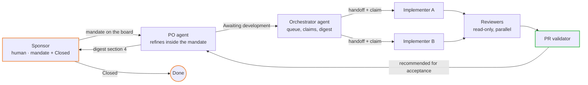

# Scenario — agent-to-agent

Agents hand work to agents. An orchestrator-agent runs the queue; the Product Owner may be an
agent working under a human **sponsor**. It looks like a company of agents — and it still ends
with a person, because `Closed` is a human act ([`core/05-states.md`](../../core/05-states.md)).



## Who is human

| Role | Kind | Notes |
|---|---|---|
| Product Owner | agent (under a sponsor) **or** human | An agent PO refines, splits and orders **inside the mandate** |
| Orchestrator | agent — required | Pulls, hands off, records claims, arbitrates, builds the digest |
| Implementer | agents | Many, one claim each; scopes from `agents/ownership.yml` |
| Reviewer | agents | Never the implementer of the same item |
| Approver | human — the sponsor | Accepts in batch if they like; the digest is the queue |

## The mandate

The sponsor writes, on the board — an Epic, and the *Now* block of `CURRENT-FOCUS.md` — what the
PO-agent may decide alone: which Features, which priority rules, which limits. Inside it the
agent acts; at its edge, every decision is a human gate (`RULE-HITL` triggers 3 to 5). Money,
access and publication are never inside a mandate. A PO-agent without a written mandate is a
PO-agent that will invent one.

## `instance.yml`

```yaml
topology: agent-to-agent
roles:
  product_owner: { kind: agent, title: Backlog agent }     # or a human
  orchestrator:  { kind: agent, title: Delivery orchestrator }
  implementer:   { kind: agent, title: Implementer }
  reviewers:     { kind: agent, roster: agents/roster.yml }
  approver:      { kind: human, title: Sponsor }
```

`make instance` refuses this topology with a human orchestrator — that would be
[`agent-to-human`](agent-to-human.md).

## How the agents talk to each other

They do not, except through the item ([`core/15`](../../core/15-topologies.md), *How agents
coordinate*). The orchestrator writes a handoff and a claim on the item; the implementer writes
the conclusion comment on the item; a question from one agent to another is a comment or an
`Issue` on the item. A channel between agents is `AP-BOT-CHATTER`: it costs tokens and leaves no
trace. If your runtime lets agents message each other directly, the adapter's `mapping.yml`
says so and the rule still holds — the message is a courtesy; the item is the record.

## What to watch

- **Claims.** With several implementers, a second claim on an open scope is the failure to
  expect. The orchestrator refuses it and opens a scope-conflict `Issue` (`RULE-ARBITRATION`);
  the validator refuses the PR if the orchestrator did not.
- **Recommended for acceptance is not acceptance.** The PO-agent's last comment on an item says
  what evidence it read and recommends. The sponsor reads *Not verified / not claimed* first,
  then decides. Twenty recommendations accepted in an hour without reading them is
  `AP-AGENT-CLOSES` with a human rubber stamp.
- **Sprint close.** A written round, no room: the orchestrator-agent opens the ceremony item at
  the sprint-close time, every role posts its part within the window — the implementers their
  evidence and cards, the reviewers their findings, the PO-agent its refinement decisions and the
  carry-over it may decide inside the mandate — and the orchestrator compiles the minutes. The
  sponsor reads the digest, decides what is outside the mandate and sets `Closed`. The things a
  retrospective changes are briefs, floors, the mandate and the Definition of Ready — not the
  models ([`core/ceremonies/sprint-close.md`](../../core/ceremonies/sprint-close.md)).
