# Scenario — agent-to-human

A person plans and accepts. Agents execute and review. This is the topology the rest of the kit
assumes when it says nothing else.

```mermaid
flowchart LR
    po[Product Owner<br/>human] -->|card + handoff| orc[Orchestrator<br/>agent, or the PO by hand]
    orc -->|claim + handoff on the item| imp[Implementer<br/>agent]
    imp -->|receipt + conclusion| rev[Reviewers<br/>agents, read-only, parallel]
    rev -->|verdicts| gate[PR validator]
    gate --> ap[Approver<br/>human]
    ap -->|Closed| done((Done))
    style po stroke:#8b949e,stroke-width:2px
    style ap stroke:#f0883e,stroke-width:2px
    style done stroke:#f0883e,stroke-width:2px
```



## Who is human

| Role | Kind | Notes |
|---|---|---|
| Product Owner | human | Writes the card, walks the Definition of Ready, accepts |
| Orchestrator | agent **or** human | Unattended: an agent pulls *Awaiting development* items. Supervised: the PO does it by hand with the prompt pack |
| Implementer | agent | One per item, one claim |
| Reviewer | agent | Two or more, in parallel, read-only |
| Approver | human | Usually the PO; the customer when there is one |

## `instance.yml`

```yaml
topology: agent-to-human
roles:
  product_owner: { kind: human, title: Product Owner }
  orchestrator:  { kind: agent, title: Orchestrator }      # or kind: human
  implementer:   { kind: agent, title: Implementer }
  reviewers:     { kind: agent, roster: agents/roster.yml }
  approver:      { kind: human, title: Product Owner }
```

## Two modes, same topology

| Mode | What it looks like | Start with |
|---|---|---|
| **Supervised** | The PO pastes the prompt pack into a chat, one conversation per role | [`adapters/prompt-pack/`](../../adapters/prompt-pack/README.md) and [`docs/quickstart-30min.md`](../quickstart-30min.md) |
| **Unattended** | A coding CLI or a bot pulls Ready items, opens PRs, posts receipts; the validator runs in CI | [`adapters/_template/`](../../adapters/_template/README.md) and [`automation/ci/INSTALL.md`](../../automation/ci/INSTALL.md) |

## What to watch

- The PO is the bottleneck, by design. Section 4 of the digest is their queue; if it grows day
  over day, review daily, not at the end of the iteration ([`core/ceremonies/review.md`](../../core/ceremonies/review.md)).
- A supervised PO who also plays orchestrator must still **record the claim on the item** before
  pasting the handoff. The validator checks it.

## Sprint close

Friday afternoon by default, one session, in this order: Review, Retrospective, Refinement
([`core/ceremonies/sprint-close.md`](../../core/ceremonies/sprint-close.md)). The PO and the people
who test are in the room; the agents are not. Before the session the orchestrator — an agent, or
the PO with the prompt pack — opens the ceremony item (`<iteration name> — Sprint close`) and posts
the agents' cards on it, drawn from evidence: the rejections, the expired claims, the review
findings. The PO writes their own cards, decides the carry-over of every open item, names the next
iteration and closes the ceremony item once the minutes are attached. Worked example:
[`examples/ceremonies/sprint-close-example.md`](../../examples/ceremonies/sprint-close-example.md).
