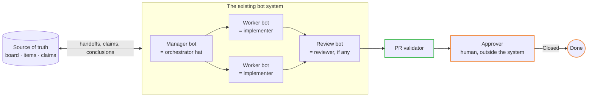

# Scenario — bot-team

A system of bots already exists — a manager bot that plans and dispatches, worker bots that
execute, maybe a bot that reviews — running as if it were a small company. Examples of the class,
not dependencies of the kit: a multi-agent product built on one vendor's models, a fleet of
coding CLIs on virtual machines with a scheduler in front, a self-hosted agent framework with its
own roles. PACT does not replace such a system. It **wraps** it: the board, the states, the gate
and the human at the end sit around whatever the system does inside.



## Map their roles onto the roster

Write each hat as a role in `instance.yml`, with the bot's own name as the title. That table *is*
the adoption.

| Their role | PACT role | Kind | If they do not have one |
|---|---|---|---|
| Manager / planner bot | orchestrator | agent | A person wears the hat — [`independent-agents`](independent-agents.md) |
| Worker bots | implementer | agent | — |
| Review bot | reviewer | agent | Run the roster's reviewers beside the system with the prompt pack |
| Product bot, if any | product_owner | agent, under a sponsor | A human PO |
| — | approver | **human**, outside the system | Always a person. The system may propose; it never closes |

```yaml
topology: bot-team
roles:
  product_owner: { kind: human, title: Product Owner }
  orchestrator:  { kind: agent, title: Fleet manager }       # their manager bot
  implementer:   { kind: agent, title: Fleet worker }        # their worker bots
  reviewers:     { kind: agent, roster: agents/roster.yml }  # theirs, or ours
  approver:      { kind: human, title: Product Owner }
```

## Bind the runtime

Copy [`adapters/_template/`](../../adapters/_template/README.md) to `adapters/<their-name>/` and
fill `mapping.yml` honestly: for each concept — agent definition, read-only reviewer, parallel
review, single writer, claim, human gate — does the system **enforce** it, **advise** it, or not
support it? The PR validator stands in for whatever it does not support
([`adapters/_contract/adapter-spec.md`](../../adapters/_contract/adapter-spec.md)). `out/` is
what you put where the system reads its instructions.

## Three things the system must give up

1. **Its memory as the record.** The board is the source of truth. Every handoff, claim,
   conclusion and gate request lands on the item; the system may keep its own copy
   (`AP-CHANNEL-AS-SOT`, `AP-CLAIM-IN-FILE`).
2. **Closing.** The manager bot marks *recommended for acceptance*; a person sets `Closed`.
3. **Silent decisions.** Money, access, publication, irreversible product choices and ambiguity
   are human gates (`RULE-HITL`), however confident the system is.

## What to watch

- A system that "already has a reviewer" often has the same model reviewing its own diff.
  Implementer and reviewer are never the same agent on the same item (`RULE-ROLES`); if the
  system cannot separate them, the roster's reviewers do the review.
- The system's internal channel will fill with bot-to-bot messages. That is fine inside the
  system; it is `AP-BOT-CHATTER` the moment a decision lives only there.

## Sprint close

The system may hold the round in its own channel — a Grok-style bot team's chat, a Hermes-style
agent framework's channel, the scheduler channel of a fleet of coding CLIs; examples of the
class, not dependencies — because that is where its bots already talk. Two conditions make it a
ceremony rather than chatter: the transcript, or the manager bot's summary of it, is attached to
the ceremony item before the minutes are signed; and every decision that counts — the carry-over
of each open item, the changes to briefs and floors, the next iteration's name — is written on
the item by the role that may take it: the manager inside its mandate, the human Approver
otherwise ([participation by topology](../../core/ceremonies/README.md#participation-by-topology--rule-ceremony-participation)).
A decision that lives only in the channel was not taken.
