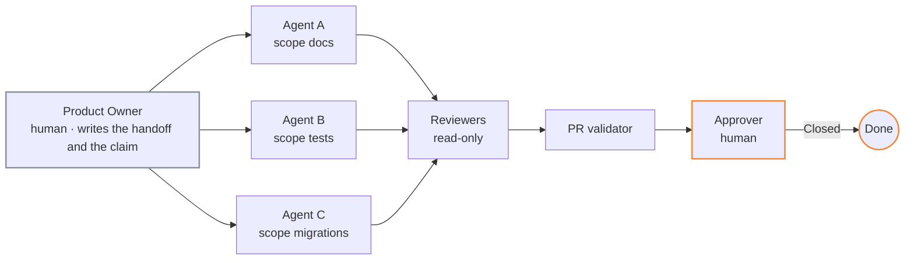

# Scenario — independent-agents

Several specialised agents, each working alone on its own items, dispatched by a person. There
is no orchestrator because there is no shared queue: a documentation agent, a test agent, a
migration agent, each with scopes that never meet.



## Who is human

| Role | Kind | Notes |
|---|---|---|
| Product Owner | human | Writes the card and the handoff |
| Orchestrator | **human** — the PO wears the hat | Records the claim, sets *In development*, reads the digest as a saved query |
| Implementer | one agent per item | Each with its own scope in `agents/ownership.yml` |
| Reviewer | agent | The roster's reviewers, per scope |
| Approver | human | |

## `instance.yml`

```yaml
topology: independent-agents
roles:
  product_owner: { kind: human, title: Product Owner }
  orchestrator:  { kind: human, title: Product Owner }     # a person dispatches; no agent queue
  implementer:   { kind: agent, title: Implementer }
  reviewers:     { kind: agent, roster: agents/roster.yml }
  approver:      { kind: human, title: Product Owner }
```

`make instance` refuses this topology with an agent orchestrator — if an agent runs the queue,
you are in [`agent-to-agent`](agent-to-agent.md).

## The one rule that still bites

**One writer per scope.** Independence is a property of the scopes, not of the agents. Two
agents on unrelated items that both touch `src/**` share a scope and need a claim each; the
second one waits. Write `agents/ownership.yml` so that the agents' territories do not overlap,
and the claims become a formality — a formality the validator still checks.

## When to move on

The day two agents wait on each other, or the person spends the morning dispatching, this
topology has outgrown itself: add an orchestrator and switch to
[`agent-to-agent`](agent-to-agent.md). Nothing else in the instance changes.

## Sprint close

The dispatcher runs it, in a room or alone at a keyboard. Each agent has posted its cards on the
items it worked; the dispatcher reads them on the ceremony item, decides the carry-over of every
open item — most will carry, since one agent owns each — names the next iteration and attaches
the minutes ([`core/ceremonies/sprint-close.md`](../../core/ceremonies/sprint-close.md)).
